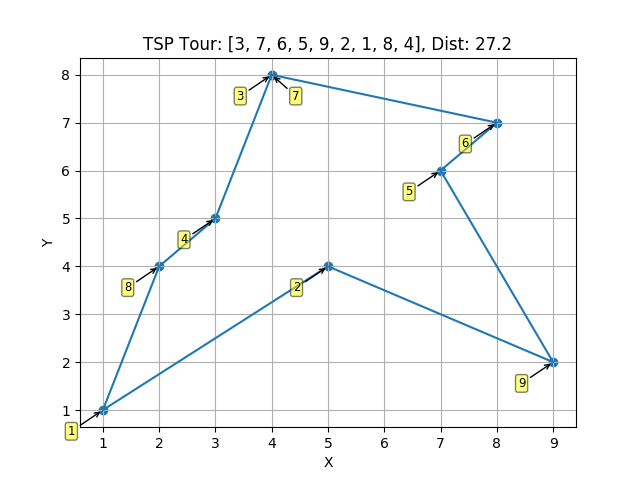
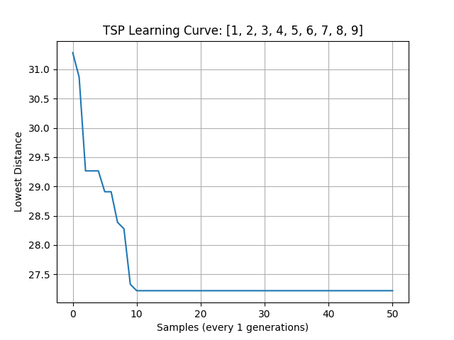

# TSP Genetic
Genetic algorithm for solving the Traveling Salesman Problem



## Overview
This project was an assignment for an algorithms course at Eastern Kentucky University, Spring, 2019.

The goal was to create a genetic algorithm that could solve a traveling salesman problem for a set number of cities
(points in cartesian plane), given below:

```
(1, 1)
(5, 4)
(4, 8)
(3, 5)
(7, 6)
(8, 7)
(4, 8)
(2, 4)
(9, 2)
```

The algorithm was able to closely approximate (or find) the solution consistently using a population of 500 chromosomes,
50 generations, and a probability of 1:1000 of a chromosome mutation.

## How it works


This algorithm uses the order crossover method of reproduction where a certain contiguous subset ("pick") of cities is
kept the same while the rest are pulled from the other chromosome with which it is reproducing.

The initial presentation of the problem suggested forming a pseudo weighted pie chart of each chromosome (tour) based on
the inverse of how short the tour was and randomly selecting chromosomes for reproduction from it. This method did not 
appear to converge at all, so it was abandoned in favor of only letting the top 50% of each generation reproduce. 
This method of selection worked much better.

## Requirements
#### Major
 * Python 3 (only tested on 3.6 and 3.7)
#### Python Packages (`pip3 install ...`)
 * matplotlib
 * prettytable

## Usage
```
Usage:  ./tsp_solve.py <args> <optional args>

Args:
    -p <population size>
    -g <number of generations>
    -m <mutation probability>

Optional Args (just the flag, no following value):
    --plot (save best tour and learning curve plots)
    --table (print table of population information after evolving)

```

## Example
```
./tsp_solve.py -p 500 -g 50 -m 1000 --plot --table
```
